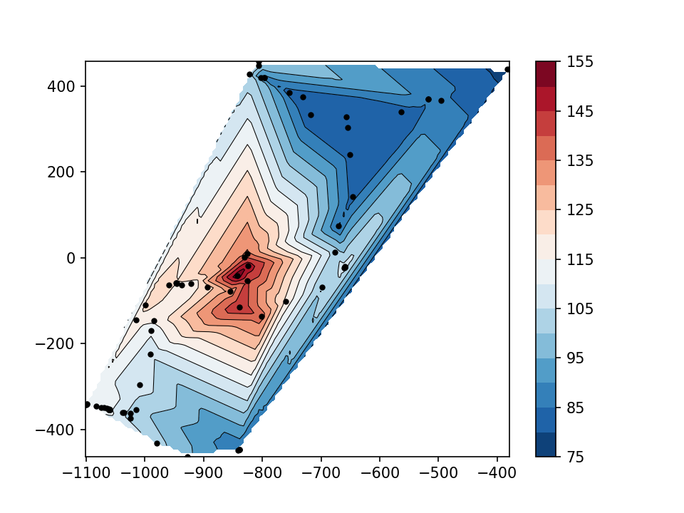

## Originally from https://github.com/PPartisan/THE_LONG_DARK

##  Simply adapted to LINUX by Bernardo Alves Furtado

## N O T E . 
You have to set your DESKTOP folder as the screenshot folder, because that is the default to where the 
screenshoots go when pressing F8

## 1 - Installation

I have adapted the scripts for Linux. Clone and go.

## 2 - Usage

from your Terminal, do

> python main.py

Once the ( minimalistic ;-) ) window is opened, you will need to select the path to the screenshots: **your DESKTOP** --
and the path for the created maps and coordinates files.

### 2.1 - Create a map while playing

To start an interactive mapping session

0. Launch THE LONG DARK -- Use ALT + TAB to go to your Terminal
1. Choose maps directory. Choose it
2. Choose screenshots directory. Direct it to your DESKTOP
3. Click on Start recording

### Everytime you go inside a building, push STOP RECORDING, then start recording again

This is because the coordinates systems inside buildings goes haywire.

### 2.2 - Create topo maps from coordinates files
 
 Click on "create maps". The script will automatically create topo maps according to the screenshots and coordinates files, and save them to the desired location.
  
Here is a sketch of leaving the tunnels towards the Keeps' Path in BlackRock

An example of coordinates output is at coords.txt
